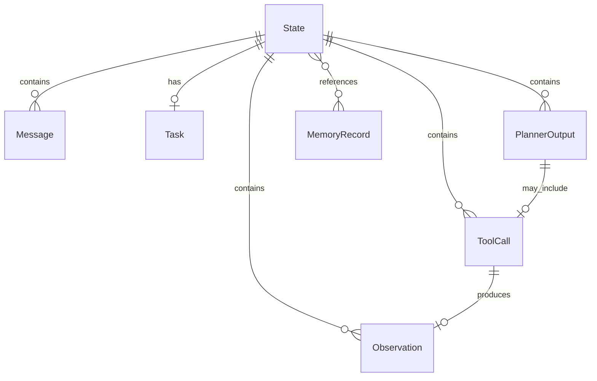

# Domain Model

> Jarvis 核心领域对象设计，仅定义不写实现。  
> 相关文档：[Architecture](./02-architecture.md) · [Interface Spec](./09-interface-spec.md) · [Runtime State Machine](./04-runtime-state-machine.md)

---

## 对象概览

| 对象 | 职责 | 引入 Phase |
|------|------|------------|
| Message | 消息 | Phase3 |
| State | 运行状态 | Phase3 |
| Task | 当前任务 | Phase3 |
| PlannerOutput | Planner 输出 | Phase5 |
| ToolCall | 工具调用 | Phase6 |
| Observation | 工具结果 | Phase6 |
| MemoryRecord | 记忆条目 | Phase8 |

---

## Message

### 字段

| 字段 | 类型 | 说明 |
|------|------|------|
| id | str | 唯一标识 |
| role | MessageRole | `user` \| `assistant` \| `system` \| `tool` |
| content | str | 文本内容 |
| metadata | dict | 扩展信息 |
| created_at | datetime | 创建时间 |

### 生命周期

- **创建**：User 输入或 Assistant/Tool 回复时
- **不可变**：创建后不修改，追加到 State.messages
- **销毁**：随 State 归档或 Session 结束

### 状态变化

无内部状态；role 在创建时确定。

---

## State

### 字段

| 字段 | 类型 | 说明 |
|------|------|------|
| id | str | 运行实例 ID |
| status | StateStatus | 见状态图 |
| messages | list[Message] | 消息历史 |
| task | Task \| None | 当前任务 |
| tool_calls | list[ToolCall] | 工具调用序列 |
| observations | list[Observation] | 工具结果序列 |
| planner_outputs | list[PlannerOutput] | Planner 历史 |
| memory_refs | list[str] | MemoryRecord ID 引用（Phase8+） |
| error | str \| None | 失败信息 |
| created_at | datetime | 创建时间 |
| updated_at | datetime | 更新时间 |

### 生命周期

```text
Created → Running → WaitingTool → Completed
                  ↘ Failed
                  ↘ Cancelled
```

### 状态图

```text
        Created
           │
           ▼
        Running ◄──────────────┐
           │                   │
           ▼                   │
      WaitingTool ─────────────┘
           │
           ▼
       Completed

Running / WaitingTool ──→ Failed
Running / WaitingTool ──→ Cancelled
```

| 状态 | 说明 |
|------|------|
| Created | 初始创建 |
| Running | Planning / Executing |
| WaitingTool | 等待 Tool 返回 |
| Completed | 正常结束 |
| Failed | 异常终止 |
| Cancelled | 主动取消 |

与 Runtime 状态机映射见 [Runtime State Machine — State 映射](./04-runtime-state-machine.md#state-与-runtime-状态映射)。

---

## Task

### 字段

| 字段 | 类型 | 说明 |
|------|------|------|
| id | str | 任务 ID |
| description | str | 任务描述 |
| goal | str | 目标 |
| status | TaskStatus | `pending` \| `in_progress` \| `completed` \| `failed` |
| subtasks | list[Task] | 子任务（Phase11+） |
| created_at | datetime | 创建时间 |

### 生命周期

- **创建**：Planner 解析 User 意图（Phase5）或 Runtime 初始化（Phase3 占位）
- **更新**：Planner 分解或更新 goal
- **完成**：status = completed 或 State 进入 Completed

### 状态变化

```text
pending → in_progress → completed
                    ↘ failed
```

---

## PlannerOutput

### 字段

| 字段 | 类型 | 说明 |
|------|------|------|
| id | str | 输出 ID |
| decision_type | DecisionType | `reply` \| `tool_call` \| `clarify` |
| content | str \| None | 直接回复 |
| tool_call | ToolCall \| None | 工具调用 |
| clarify_message | str \| None | 澄清问题 |
| reasoning | str \| None | 推理过程（调试） |
| created_at | datetime | 创建时间 |

### 生命周期

- **创建**：Planner 每次调用
- **消费**：Runtime 解析并执行
- **归档**：追加到 State.planner_outputs

### 状态变化

无内部状态。

---

## ToolCall

### 字段

| 字段 | 类型 | 说明 |
|------|------|------|
| id | str | 调用 ID |
| tool_name | str | 工具名 |
| arguments | dict | 参数 |
| status | ToolCallStatus | `pending` \| `running` \| `completed` \| `failed` |
| created_at | datetime | 创建时间 |

### 生命周期

```text
pending → running → completed
                 ↘ failed
```

### 状态变化

见上；Observation 返回后 status 终态确定。

---

## Observation

### 字段

| 字段 | 类型 | 说明 |
|------|------|------|
| id | str | 观测 ID |
| tool_call_id | str | 关联 ToolCall.id |
| success | bool | 是否成功 |
| content | str \| dict | 结果 |
| error | str \| None | 错误信息 |
| created_at | datetime | 创建时间 |

### 生命周期

- **创建**：Tool 执行完毕
- **不可变**：创建后不修改
- **消费**：Planner 下一轮读取

---

## MemoryRecord

### 字段

| 字段 | 类型 | 说明 |
|------|------|------|
| id | str | 记忆 ID |
| key | str | 检索键 |
| content | str | 内容 |
| scope | MemoryScope | `session` \| `user` \| `global` |
| embedding_ref | str \| None | 向量索引引用（可选） |
| created_at | datetime | 创建时间 |
| expires_at | datetime \| None | 过期时间 |

### 生命周期

- **创建**：Memory 层写入（Phase8+）
- **读取**：Context Builder 检索（Phase9）
- **持久化**：SQLite 存储（Phase10）
- **过期**：expires_at 或压缩策略删除

### 状态变化

无复杂状态；存在即有效，过期即逻辑删除。

---

## 对象关系



---

## 实现映射

| 对象 | 目录 | Phase | 实现文件 |
|------|------|-------|----------|
| Message, State, Task | runtime/ | Phase3 | `runtime/models.py` |
| PlannerOutput | planner/ | Phase5 | — |
| ToolCall, Observation | tools/ | Phase6 | — |
| MemoryRecord | memory/ | Phase8 | — |

### Phase3 实现说明

- `Message`：`frozen=True`，创建后不可变
- `StateStatus`：`created` / `running` / `waiting_tool` / `completed` / `failed` / `cancelled`
- `TaskStatus`：`pending` / `in_progress` / `completed` / `failed`
- `State.tool_calls` / `observations` / `planner_outputs`：Phase3 暂用 `list[Any]`，Phase5/6 替换为强类型

见 [Project Structure](./05-project-structure.md)。
